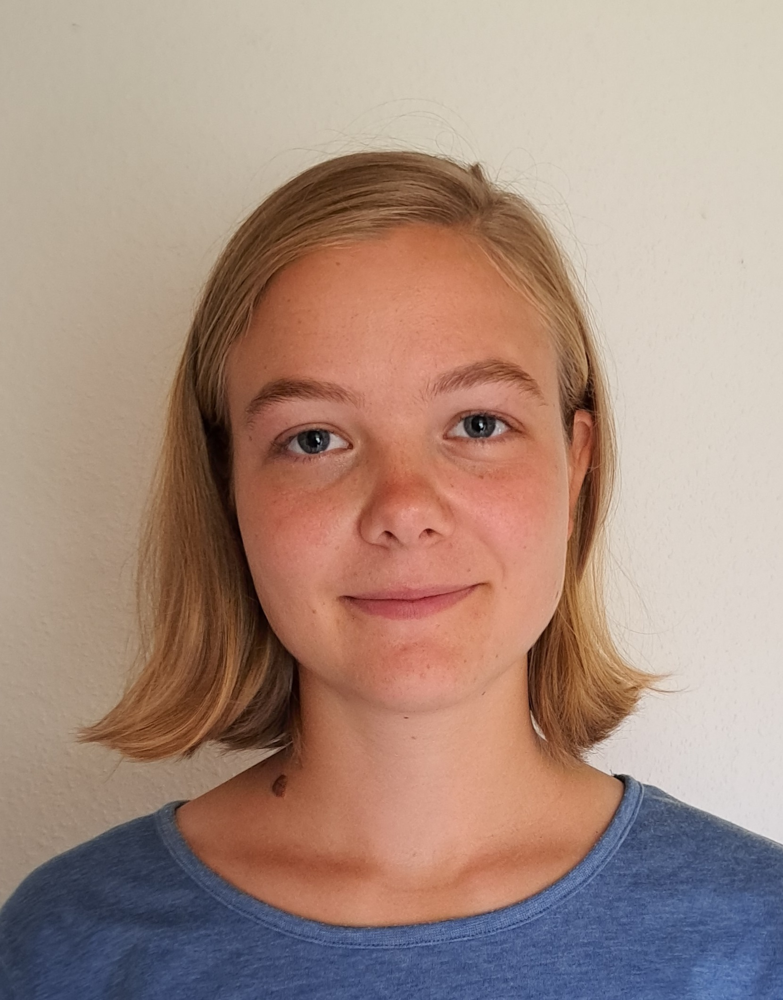
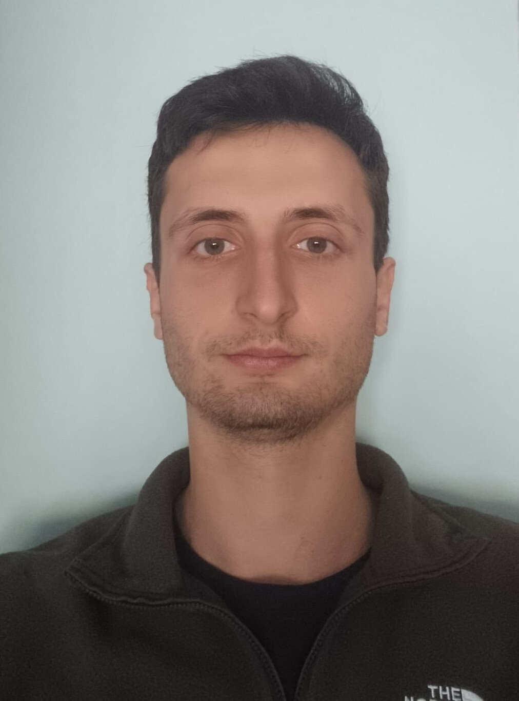

# Group

On this page, I list students that I have supervised and their projects. If you
would like to contact a student, please reach out and I would be more than happy
to put you in touch.

## Postdoctoral researchers

### Dr Adriana Dias

## PhD students supervision

{ width="150" align=right }
### Ann Malz 
- Start date: 2023
- Thesis title: TBC

I am a PhD student in astrophysics, working with Greg Ashton and Nicolo Colombo on using machine learning for gravitational wave analysis. I am currently working on applying conformal prediction to determine uncertainties. When making use of machine learning, for example applied to gravitational wave parameter estimation, quantifying the uncertainty of how accurate the estimate is is essential. Conformal prediction provides a method to determine this uncertainty for any point prediction algorithm. 

My background is in theoretical physics and astrophysics, with a Masters degree from the University of Glasgow. In my masters project, working with John Veitch, I applied machine learning in the form of normalising flows to model and hence remove glitches from gravitational wave data, with the aim to improve the Bayesian inference based parameter estimation in the presence of glitches. 

Besides research, I enjoy volunteering with projects promoting science and engaging young people in STEM, and have been involved in various projects with the Swedish Federation of Young Scientists, such as organising Rays Research Academy for Young Scientists. In my free time I also enjoy a variety of outdoor activities as well as good literature.

{ width="150" align=right }
### Sean Hibbit
- Start date: 2023
- Thesis title: TBC

I'm currently a PhD student at Royal Holloway, under Xavier Rojas and Greg Ashton. My work is focused on an idea to further the Weber bar resonance bar concept using Low-Temperature methods and Optical Mechanics. I completed my MSci at Royal Holloway, my dissertation was on modelling many body quantum systems; this also included a research review on quantum computers and associated algorithms. My research interests focus mainly on Low-Temperature physics and Condensed matter. 

My previous projects include

- Creating a computer model, to simulate many-body quantum systems and explore the Fermi-Dirac Distribution with Grégoire Ithier.
- Designing and building a successful low-temperature experiment, currently used to introduce undergraduate to low temperature physics. This was under L. V. Levitin.
- Designing and creating software in python to manage a vapor deposition nano-fabrication tool for Phil Meeson.

{ width="150" align=right }
### Mattia Emma
- Start date: 2022
- Thesis title: TBC

I am a PhD student in gravitational wave astronomy under the supervision of Dr. Greg Ashton. My research portfolio spans various facets of gravitational wave physics, where I actively contribute as a member of the Laser Interferometer Gravitational-Wave Observatory (LIGO). One significant aspect of my work involves gravitational wave data analysis, where I delve into the intricacies of parameter estimation. Thus far I have been looking into the problems arising from the approximations used in our analysis with the increasing amount of detected signals, and into the benefits introduced by using more detectors for the analysis and their dependence on the performance of the single detectors.

Following my MSc in Astrophysics in Potsdam, where I focused on Numerical Relativity simulations, I am still collaborating with Prof. Dr.  Tim Deatrich and Dr. Violetta Sagun, specifically exploring dark matter-admixed neutron stars and their detectability through our current and future ground-based detectors. I have completed my BSc in Physics at La Sapienza University in Rome, Italy, where my thesis on the constraints on the tidal deformability of neutron stars through gravitational waves was supervised by Prof. Dr. Francesco Pannarale.

Beyond the academic realm, I am passionately committed to fostering equal access to education globally. As a Cumberland Lodge Fellow in the 2023-2025 cohort, I actively participate in initiatives aimed at raising awareness of societal issues and trying to find solutions through dialogue. In this pursuit, in 2019 I founded a non-governmental organization dedicated to combating educational disparities, with a specific focus on enabling girls from underprivileged backgrounds to access secondary education. Additionally, I am a basketball player for the University team and my interests extend to the realms of African literature, history, and cooperative endeavors.

{ width="150" align=right }
### Nikhil Sarin
- Start date: 2018
- Graduated: 10/2021
- Thesis title: "The observational consequences of neutron star postmerger remnants"
- Personal website: [nikhil-sarin.github.io](https://nikhil-sarin.github.io)

I co-supervised Nikhil along with Paul Lasky while an Assistant Lecturer at Monash University. Nikhil had a wide range of interests and was a wonderful student to supervise, always pushing me into parts of astronomy I hadn't yet ventured and studying the literature in depth as he went. Nikhil is now a NORDITA Fellow and overall excellent scientist.

## PhD student support
Below, I list students to which I have contributed to their supervision.

- Zhi-Qiang You
- Rowina Nathan
- Simone Mozzon
