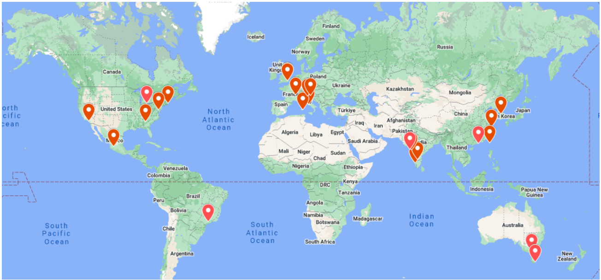
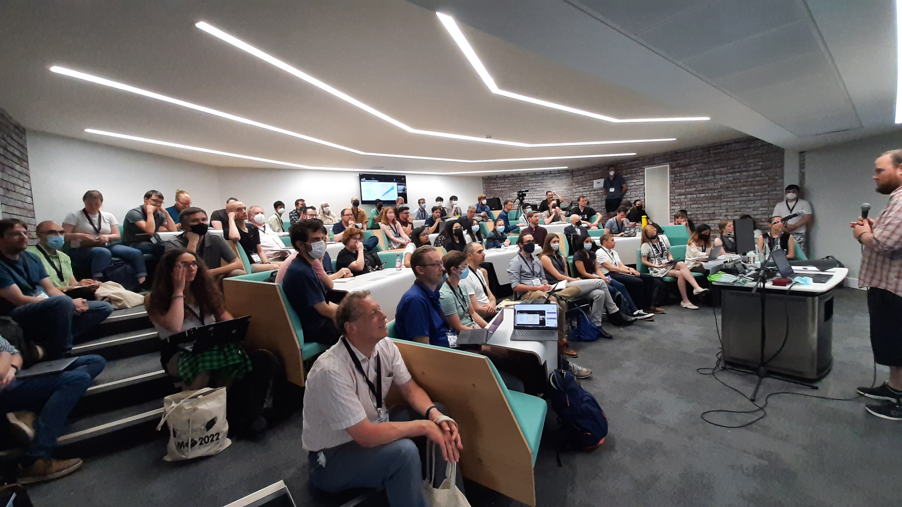

# Dr Gregory Ashton

## About me

I am a Lecturer in Physics at [Royal Holloway, University of
London](https://www.royalholloway.ac.uk/research-and-teaching/departments-and-schools/physics/).
I began my research career at the University of Southampton working with Ian
Jones and Reinhard Prix where I completed by PhD in 2016 on [Timing variations in neutron stars:
models, inference and their implications for gravitational
waves](http://eprints.soton.ac.uk/401822/1/GregoryAshton_Thesis_WithLinks.pdf).
Following this I held a postdoc position at the Albert Einstein Institute, Hannover before moving in 2018 to Monash University in Australia to work as an Assistant Lecturer with [Paul Lasky](http://users.monash.edu.au/~plasky/).
I then briefly joined the [Institute for Cosmology and Gravitation](http://www.icg.port.ac.uk/) (ICG) at the University of Portsmouth working with Laura Nuttall as a Research Fellow before taking up my current post.
My research interest is the relativistic astrophysics of neutron stars and black holes. I am a member of the [LIGO Scientific Collaboration](http://www.ligo.org) and co-chair the Collaborations largest and most active observational science group, the [Compact Binary Group](https://dcc.ligo.org/LIGO-M1200248/public).

* Contact: gregory.ashton@ligo.org
* [My CV](pdfs/GregoryAshton_CV.pdf)
* [ADS library](https://ui.adsabs.harvard.edu/public-libraries/Ns6_-Nu-SsO4gxJrZ0_3sQ)

## News

* 18/May/2023 I gave a colloqium on Glitch-robust gravitational wave astronomy at Los Alamos (virtually).

* 15/May/2023 I co-organised and helped to run the 6th GWOSC [Open Data Workshop](https://gw-odw.thinkific.com/courses/gw-open-data-workshop-6). Below is a map of all the study hubs!
  

* 11/May/2023 I gave a colloqium at the Institute for Cosmology and Gravitation, University of Portsmouth. I talked about Glitch-robust gravitational-wave astronomy!

* 05/Apr/2023 Double new paper day! Jack Heinzel submitted [Inferring the Astrophysical Population of Gravitational Wave Sources in the Presence of Noise Transients](https://arxiv.org/abs/2304.02665) to MNRAS for review while Rowina Nathan submitted [Improving pulsar-timing solutions through dynamic pulse fitting](https://arxiv.org/abs/2304.02793) also to MNRAS for review. Both of these are excellent PhD students I have had the good forture to help with their project.

* 06/Feb/2023 My paper [Gaussian Processes for Glitch-robust Gravitational-wave Astronomy](https://academic.oup.com/mnras/article-abstract/520/2/2983/7028786) was published in MNRAS.

* 06/Dec/2022 I was invited to speak on [Key results from ground-based gravitational-wave detectors](https://www.gwpaw2022.org/program.html) at the GWPAW 2022 meeting.

* 01/Sep/2022 PhD student Mattia Emma started in my group!

* 13/Jul/2022 Our paper [Parameterised population models of transient non-Gaussian noise in the LIGO gravitational-wave detectors](https://iopscience.iop.org/article/10.1088/1361-6382/ac8094) has been published in CQG.

* 11/Jul/2022 I led the organisation of the Gravitational-wave astronomy parallel session at [NAM2022](https://nam2022.org/science/parallel-sessions/details/2/174). We where over subscribed by a factor of 2 on talks and the room was full too. Really exciting to see the breadth and talent of people working on GWs in the UK. Thanks to all the other organisers who helped make it happen.
  

* 04/Jul/2022 My paper with Tim Dietrich [The use of hypermodels to understand binary neutron star collisions](https://www.nature.com/articles/s41550-022-01707-x) was published in Nature Astronomy.

* 01/Jun/2022 Our [Nested Sampling primer](https://ui.adsabs.harvard.edu/abs/2022arXiv220515570A/abstract) was published in [Nature Reviews](https://www.nature.com/articles/s43586-022-00121-x). While I am first author, you should realise this is because "A" is the first letter of the alphabet! Andrew Fowlie led the effort and I am deeply indepted to him as I learned a lot. My contribution, along with Matt Pitkin and John Veitch was to the gravitational-wave application section.

* 25/May/2022 Today, I joined the [smallpeice trust](https://www.smallpeicetrust.org.uk/) and RHUL's Girl's Into Astrophysics event!

* 29/Apr/2022 It is a new paper day! [GWCloud](https://arxiv.org/abs/2204.13267) hit the arXiv which details the inner workings of searchable repository for the creation and curation of gravitational-wave inference results. This project started back in 2018 IIRC with several ADACS applications by Paul Lasky. It has been a pleasure to work on and I look forward to the future of the project.

* 27/Apr/2022 Today I had the pleasure of examing a PhD student thesis. I'll delay in giving the name until it is all official. But, they defended very well and can now proudly call themselves Docter!

* 06/Apr/2022 I was a judge for the best Student Prize at [BritGrav 2022](https://www.gla.ac.uk/events/conferences/britgrav22/). The conference consisted of two days of talks from students/postdocs and served as a great display of the exciting science done by scientists in the UK. The quality of talks was fantastic and it was hard to pick between them, but in the end Lucy Thomas won the best talk prize with Marion Cromb and Elsa Teixeira as runners up. Congratulations to them all.

* 01/Feb/2022 I am an Award Lead for the Alan Turing Network [Development Award](https://www.turing.ac.uk/news/24-uk-universities-receive-first-ever-turing-network-development-awards). I'm looking forward to using this to develop some interdisciplinary projects.

* 01/Dec/2021 Today I joined the SEPNet workshop [Equality, Diversity & Inclusion – Revisiting the leaky pipeline – short-term contracts and career planning](https://www.sepnet.ac.uk/he-stem-equality-diversity-inclusion-revisiting-the-leaky-pipeline-short-term-contracts-and-career-planning/). You can find my slides [here](pdfs/SEPNet-EDI-GA.pdf).

* 18/Nov/2021 I presented at the Banff IRS workshop [Detection and Analysis of Gravitational Waves in the era of Multi-Messenger Astronomy: From Mathematical Modelling to Machine Learning](http://www.birs.ca/events/2021/5-day-workshops/21w5066/schedule). You can find a recording [here](http://www.birs.ca/events/2021/5-day-workshops/21w5066/videos/watch/202111180950-Ashton.html) and my slides [here](pdfs/GregAshton_BIRF2021.pdf).

* 17/Nov/2021 With Tim Dietrich, we put out a new preprint [Understanding binary neutron star collisions with hypermodels](https://ui.adsabs.harvard.edu/abs/2021arXiv211109214A/abstract). This one shows some tentative evidence for waveform systematics in a BNS.

* 01/Nov/2021 Today I joined Royal Holloway as a Lecturer in Physics!

* 26/Oct/2021 A paper led by the ICG's Simone Mozzon [Does non-stationary noise in LIGO and Virgo affect the estimation of H0?](https://arxiv.org/abs/2110.11731) hit the arXiv today.

* 07/Oct/2021 New paper day! [Parameterised population models of transient non-Gaussian noise in the LIGO gravitational-wave detectors](https://ui.adsabs.harvard.edu/abs/2021arXiv211002689A/abstract). This work has taken nearly 2 years from the initial conception, a huge amount of computing, and lots of thinking. I really enjoyed getting into a new aspect of GW astronomy, namely the characterisation of the detector.

* 17/Sep/2021 My daughter Ada was born at 4am. Very happy, excited, and tired!

* 29/Jul/2021 New paper led by PhD student Avi Vajpeyi on [A search for intermediate-mass black holes mergers in the second LIGO--Virgo observing run with the Bayes Coherence Ratio](https://ui.adsabs.harvard.edu/abs/2021arXiv210712109V/abstract)

* 14/Jul/2021 Today I helped out in Royal Holloway's Girls into Physics program run by the [Small Piece trust](https://www.smallpeicetrust.org.uk/) where we did [Python programming for science](https://github.com/GregoryAshton/Python-for-science-programming)

* 29/Jun/2021 The LVK collaboration published [Observation of gravitational waves from two neutron star-black hole coalescences](https://arxiv.org/abs/2106.15163) in ApJL. This was a really fun project to be involved in. That we can make a definitive statement about the nature of the secondary (light-mass) object with a counterpart is testament to our understanding of controlling systematic uncertainty.

* 17/Jun/2021 We released a new paper: [Bilby-MCMC: An MCMC sampler for gravitational-wave inference](https://ui.adsabs.harvard.edu/abs/2021arXiv210608730A/abstract). This was really fun as I got to write a sampler from scratch and remind myself of all the gory details.

* 16/Jun/2021 I helped out with the Royal Holloway [Particle Physics Masterclass](https://www.royalholloway.ac.uk/studying-here/schools-and-colleges/activities-by-subject/physics/) introducing python programming.

* 11/May/2021 New paper with PhD student Zhi-Qiang You: [Optimized localization for gravitational-waves from merging binaries](https://arxiv.org/abs/2105.04263) submitted to MNRAS.

* 10/May/2021 The Gravitational Wave Open Data Workshop #4 kicked off today on [gather.town](https://gather.town/).

* 12/Apr/2021 Today I was elected as co-chair of the LIGO collaboration Compact Binary Coalescence (CBC) group. I join Chad Hanna and Walter Del Pozzo and look forward to helping coordinate the discovery and analysis of signals from colliding black holes and neutron stars.

* 08/Apr/2021 Today I'm taking part in Royal Holloway's Astrophysics Residential for 2021. I'm covering an [introduction to programming and how to calculate Pi using random numbers](https://github.com/GregoryAshton/AstrophysicsResidentialApril21).

* 12/Mar/2021 My students successfully nominated me for a [You’re Valued Award at Royal Holloway](https://www.su.rhul.ac.uk/voice/awards/#:~:text=You're%20Valued%20is%20a,we%20and%20the%20College%20promote.). I'm proud to add some of their comments here: “Greg is an amazing teacher. His enthusiastic approach to teaching maths to us foundation year students has made us enthusiastic as well. he is very friendly and approachable and when we need help he very patiently helps explain everything to us. He is dedicated to make us understand all  the concepts he teaches and help us learn to our best capacity.” and “Greg always focuses on our individual worries and makes sure we understand before moving on. He's very good at teaching and we're happy to have him as our maths professor :)”.

* 08/Feb/2021 I presented [Flickering of the Vela pulsar](pdfs/Flickering_of_the_vela_pulsar.pdf) to the [CAMK](https://www.camk.edu.pl/en/) journal club.

* 28/Jan/2021 My PhD student Nikhil Sarin passed his pre-submission milestone. It has been a pleasure to watch Nik develop into a great researcher - his next employer will be lucky to have him.

* 27/Jan/2021 New paper on arXiv! Work led by David Keitel ["PyFstat: a Python package for continuous gravitational-wave data analysis"](PyFstat: a Python package for continuous gravitational-wave data analysis) which updates the latest on the PyFstat package for Continuous-Wave analyses.

* 14/Jan/2021 New paper! Work led by Eric Burns ["Identification of a Local Sample of Gamma-Ray Bursts Consistent with a Magnetar Giant Flare Origin"](https://ui.adsabs.harvard.edu/abs/2021arXiv210105144B/abstract) hits the arXiv.

* 11/Jan/2021 Semester 2 gets underway at RHUL. I'm teaching FY1006 Mathematics II to 140 students in online mode for the foreseable future.

* 07/Jan/2021 I gave a talk titled ["The deepening mystery of the Vela radio-pulsar glitch"](pdfs/Bar-Ilan.pdf) at the Department of Physics, Bar-Ilan University on our recent Vela paper.

* 04/Dec/2020 I gave an improptu talk to the University of Southampton's [astrophysics group](http://www.astro.soton.ac.uk/) on our recent Vela paper.

* 16/Nov/2020 New paper ["Flickering of the Vela pulsar during its 2016 glitch"](https://ui.adsabs.harvard.edu/abs/2020arXiv201107927A/abstract) on the arXiv.

* 10/Nov/2020 I was awarded the [2020 USERN Physical and Chemical Sciences prize](https://en.wikipedia.org/wiki/USERN_Prize#Laureates_2020).

* 04/Nov/2020 I gave a presentation to Royal Holloway's Physics group ["Turning Wiggles into Science"](https://docs.google.com/presentation/d/11MZHN7b9J_f_HiNVovemcG2IuKSGWXeKzdRh7Kv54v0/edit?usp=sharing)

## Gallery
<figure>
    
    
    
    
    
</figure>

